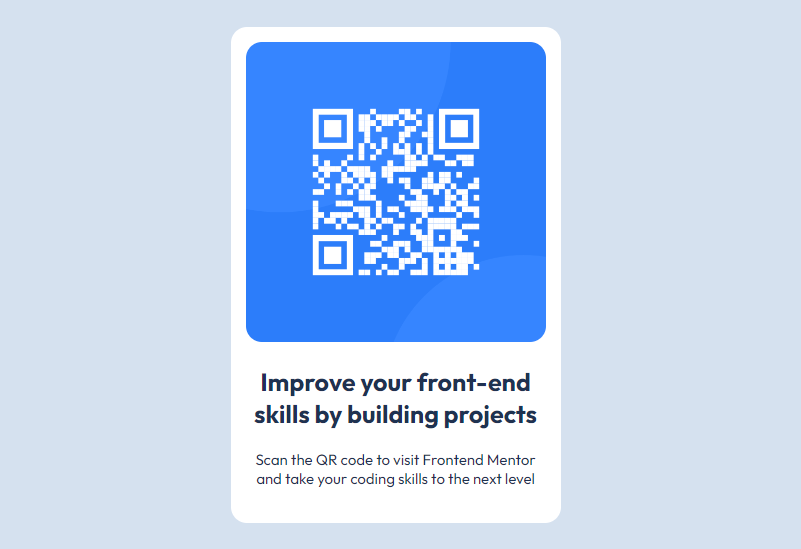

# Frontend Mentor - QR code component solution

This is a solution to the [QR code component challenge on Frontend Mentor](https://www.frontendmentor.io/challenges/qr-code-component-iux_sIO_H). Frontend Mentor challenges help you improve your coding skills by building realistic projects. 

### Screenshot

### Links

- Live Site URL: [https://calumscott4.github.io/qr-code-component-main/](https://calumscott4.github.io/qr-code-component-main/)

## My process

### Built with

- Semantic HTML5 markup
- CSS

## Author

- LinkedIn - [Calum Scott](https://www.linkedin.com/in/calum-francis-scott/)
- Frontend Mentor - [@CalumScott4](https://www.frontendmentor.io/profile/CalumScott4)
